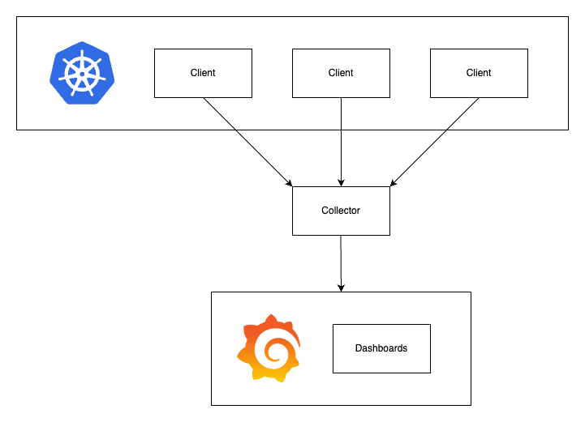

# Gobs
Lightweight and minimalist observability for distributed systems.

## Library
Found in `/lib`

### Logs
- Found in `logs.go`
- Outputs to collector via HTTP

### Metrics
- Found in `metrics.go`
- Outputs to collector via HTTP
- Supports counters, gauges, and histograms

### Traces
- Found in `traces.go`
- Outputs to collector via HTTP
- Supports spans and traces

## Collector
HTTP server for data ingestion from clients

### Endpoints
- `/logs` - update Logs from given JSON
- `/counters` - update Counters from given JSON
- `/gauges` - update Gauges from given JSON
- `/histograms` - update Histograms from given JSON
- `/traces` - update Traces from given JSON

## Testing
Manual tests done within `/main` and using Postman

### Architecture

## Resources
- https://www.splunk.com/en_us/blog/learn/observability.html
- https://www.datadoghq.com/three-pillars-of-observability/
