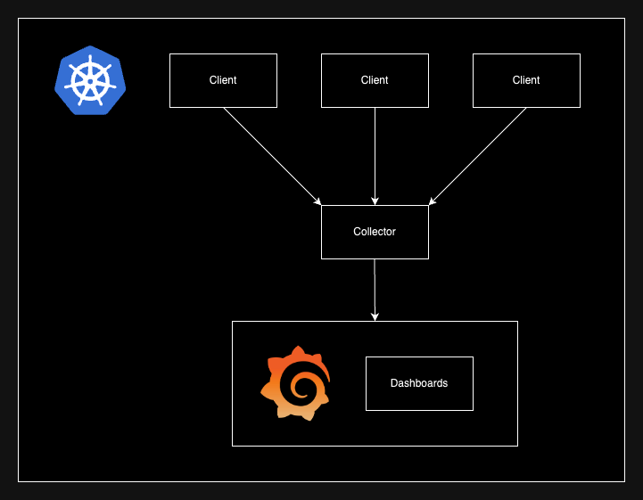

# Gobs
Lightweight and minimalist observability for distributed systems.

## Library (`/lib`)
APIs that cover the three pillars of observability!

### Logs
- Found in `logs.go`
- Outputs to collector via HTTP

### Metrics
- Found in `metrics.go`
- Outputs to collector via HTTP
- Supports counters, gauges, and histograms

### Traces
- Found in `traces.go`
- Outputs to collector via HTTP
- Supports spans and traces

## Collector (`/collector`)
HTTP server for data ingestion from clients.

### Running on Docker

1. **Build container:**
    ```sh
    docker build -f collector/Dockerfile -t gobs-collector .
    ```

2. **Run container:**
    ```sh
    docker run -d -p 8080:8080 gobs-collector
    ```

### Endpoints
- `/logs` - update Logs from given JSON
- `/counters` - update Counters from given JSON
- `/gauges` - update Gauges from given JSON
- `/histograms` - update Histograms from given JSON
- `/traces` - update Traces from given JSON

## Testing (`/main`)
Manual tests done inside simulated environment (K8s) and using Postman.

### Architecture


### Running on Kubernetes

1. **Install minikube and Docker**

2. **Load containers into minikube**
    - Start minikube: 
      ```sh
      minikube start
      ```
    - Load images: 
      ```sh
      eval $(minikube docker-env)
      ```

3. **Build containers for collector and main**
    - Build collector's container: 
      ```sh
      docker build -f collector/Dockerfile -t gobs-collector .
      ```
    - Build main's container: 
      ```sh
      docker build -f main/Dockerfile -t gobs-main .
      ```
    - Verify using:
      ```sh
      minikube ssh
      docker images
      ```

4. **Apply deployment and service files**
    - Apply collector deployment: 
      ```sh
      kubectl apply -f k8s/collector-deployment.yaml
      ```
    - Apply collector service: 
      ```sh
      kubectl apply -f k8s/collector-service.yaml
      ```
    - Apply main deployment: 
      ```sh
      kubectl apply -f k8s/main-deployment.yaml
      ```
    - Apply main service: 
      ```sh
      kubectl apply -f k8s/main-service.yaml
      ```
    - Apply Grafana deployment: 
      ```sh
      kubectl apply -f k8s/grafana-deployment.yaml
      ```
    - Apply Grafana service: 
      ```sh
      kubectl apply -f k8s/grafana-service.yaml
      ```

5. **View Grafana dashboards**
    - Port-forward dashboards: 
      ```sh
      kubectl port-forward deployment/grafana 3000:3000
      ```

### Grafana Dashboards


1. **View dashboards on `http://localhost:3000`**

2. **Create data source using JSON API**

3. **Choose URL:**
    - Using Docker:
      ```sh
      http://host.docker.internal:8080/export
      ```
    - Using Kubernetes:
      ```sh
      http://collector-service.default.svc.cluster.local:8080/export
      ```

4. **Create dashboards!**

## Resources
- https://www.splunk.com/en_us/blog/learn/observability.html
- https://www.datadoghq.com/three-pillars-of-observability/
